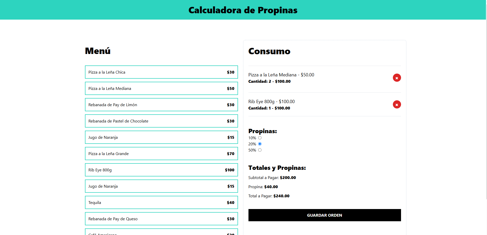

# 🧮 Calculadora de Propinas

Este es un proyecto de una **calculadora de propinas** desarrollada con **React**, **TypeScript** y **Vite**. Su propósito es ayudarte a calcular fácilmente el total a pagar en una orden incluyendo la propina.

## ✨ Funcionalidades

- 💵 Inserta el valor total de tu orden.
- 🧾 Calcula automáticamente el total con diferentes porcentajes de propina.
- 📊 Elige el porcentaje de propina que prefieras.
- ✅ Visualiza el total final con propina incluida.

## ⚙️ Tecnologías usadas

- ⚛️ [React](https://react.dev/)
- 🧠 [TypeScript](https://www.typescriptlang.org/)
- ⚡ [Vite](https://vitejs.dev/)

## 🚀 Cómo se ve?
Netlify: https://gilded-pony-b4c0b7.netlify.app/
